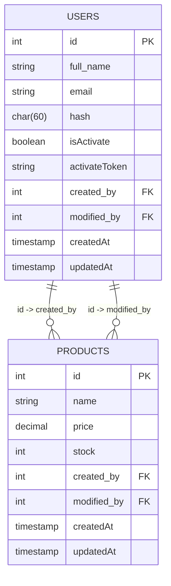

# Diagrama de base de datos

```mermaid
erDiagram
    USERS {
        int id PK
        string full_name
        string email
        char(60) hash
        boolean isActivate
        string activateToken
        int created_by FK
        int modified_by FK
        timestamp createdAt
        timestamp updatedAt
    }

    PRODUCTS {
        int id PK
        string name
        decimal price
        int stock
        int created_by FK
        int modified_by FK
        timestamp createdAt
        timestamp updatedAt
    }
    USERS ||--o{ PRODUCTS : "id -> created_by"
    USERS ||--o{ PRODUCTS : "id -> modified_by"
```